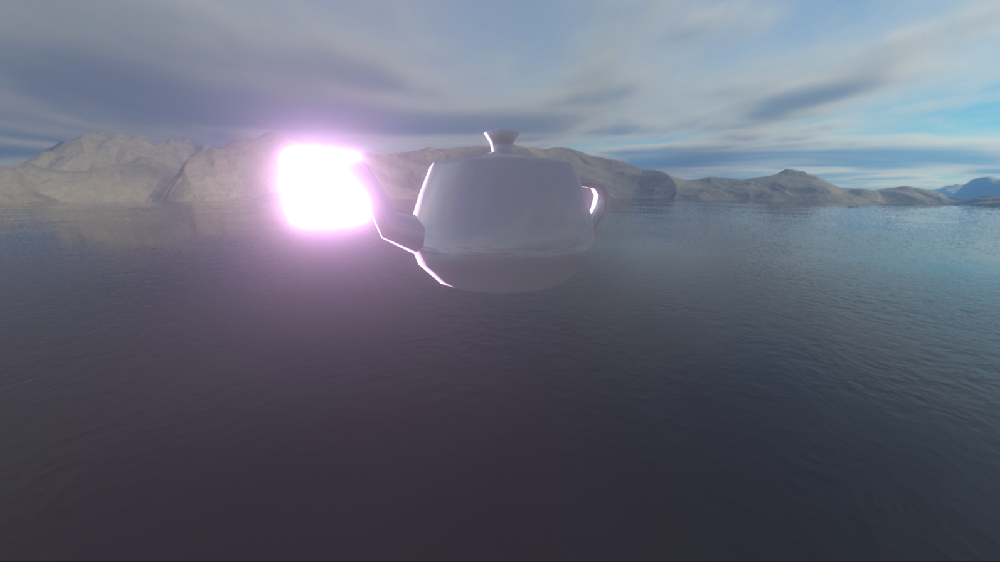

# StapleGL

No-dependency OpenGL support library, which abstracts the processes of creating buffers and shaders

[](https://github.com/dario-loi/staplegl/actions/workflows/doxy_deploy.yml)

Table of Contents
=================

- [StapleGL](#staplegl)
- [Table of Contents](#table-of-contents)
- [Install](#install)
- [Design Highlights](#design-highlights)
- [Features](#features)
- [Setup](#setup)
	- [Providing a Loader](#providing-a-loader)
- [Usage](#usage)
	- [Basic Usage](#basic-usage)
	- [Vertex buffer layout](#vertex-buffer-layout)
	- [Shaders](#shaders)
		- [Single file](#single-file)
			- [Example](#example)
		- [Multiple files](#multiple-files)
		- [Supported types of shaders](#supported-types-of-shaders)
	- [Batching](#batching)
	- [STL Algorithms on Buffers](#stl-algorithms-on-buffers)

<!-- Created by https://github.com/ekalinin/github-markdown-toc -->
# Install
```
git clone --recursive https://github.com/dario-loi/staplegl.git
```

# Design Highlights
- Very lightweight - ***StapleGL*** is merely a thin wrapper around the OpenGL functions, allowing users to create C++ objects that correspond to OpenGL objects on the GPU.
- No dependencies - ***StapleGL*** does not enforce any dependencies such as function loaders, it
also makes no assumptions about the windowing library that is used, it can therefore be 
integrated into any project with ease.
- Compatible with older OpenGL versions - ***StapleGL*** is compatible with OpenGL 3.3 and above,
so code written with ***StapleGL*** can be run on a wide range of hardware.
- Easy to use - ***StapleGL*** is designed to be as intuitive as possible, so that the user can
focus on the task, rather than the intricacies of OpenGL. Information on how to use
***StapleGL*** can be found in the [Usage](#usage) section.

# Features

***StapleGL*** supports the majority of the OpenGL objects, such as:

- Vertex buffers
- Vertex buffer layout
- Index buffers
- Uniform Buffers
- Vertex arrays
- Textures
- Render buffers
- Frame buffers
- Shader programs
- Shaders

It also offers more functionality, such as:

- Automatic shader parsing and compilation
- An instanced vertex buffer class that allows for easy and efficient batch rendering
- A simple and intuitive interface for uploading uniform data to the GPU
- Move semantics for *all* of the OpenGL objects
- Modern C++20 interfaces for increased usability and safety
- STL algorithms on OpenGL buffer contents

<br>


*A non trivial scene rendered with the help of **StapleGL** in under 350 lines of code, featuring HDR, Tone mapping, MSAA x16, PBR Bloom^[1], cube maps and environment mapping.*

^[1]: Next generation post processing in Call of Duty: Advanced Warfare, https://advances.realtimerendering.com/s2014/index.html

# Setup

***StapleGL*** is *header-only*, so all you need to do is copy the contents of the `include` 
directory into your project and include the `staplegl.hpp` header file.

If you only want to use parts of the library you can also pick and choose headers from
the `include/modules` directory.

## Providing a Loader

***StapleGL*** assumes that the OpenGL functions are loaded by the user, so it does not
provide any function loaders. This allows the user to use any function loader they want.

This repository has been set up to use `glad` so that the examples
can be made to work out of the box. If you want to use glad as well, you can generate the
files by going to the [glad website](https://glad.dav1d.de/).

> [!WARNING]
> Whichever loader you choose, it is recommended that you include it in the `include/modules/gl_functions.hpp` header file, so that the definitions are included in all of the other headers.

# Usage
## Basic Usage

Examples of increasing complexity can be found in the `examples` directory, the same
examples are also hosted on the online documentation [here](https://dario-loi.github.io/staplegl/examples).

## Vertex buffer layout
Vertex buffer layout are declared in a very intuitive way. You provide a list of shader data types and identifier names. The shader data types reside in the ```staplegl::shader_data_type``` namespace.

```cpp
staplegl::vertex_buffer_layout layout = {
	{ staplegl::shader_data_type::vec3, "position" },
	{ staplegl::shader_data_type::vec4, "color" }
};
```
A vertex buffer layout can either be declared on it's own like in the example above, or can be created as an `rvalue` directly in the constructor of ```staplegl::vertex_buffer``` (or other classes that require a vertex buffer layout).

```cpp
staplegl::vertex_buffer vbo({*vertices, sizeof(vertices)}, {
	{ staplegl::shader_data_type::type::vec3, "position" },
	{ staplegl::shader_data_type::type::vec4, "color" }
});
```
The layout is saved in the vertex buffer, so that information about the layout can be queried at runtime.

## Shaders
A shader program can be handled in two different ways. You can have separate shader files for each type of shader, or you can have one single shader file.
### Single file
With the single file approach, you only need to provide the file path and a name for the shader program. If you don't provide a name for the shader program, ***StapleGL*** will automatically set the name to be the name of the file.
```cpp
staplegl::shader_program shaders_single("Basic", "shader_examples/basic.glsl");

// the name of the shader program will be set to 'basic'
staplegl::shader_program shader_single_noname("shader_examples/basic.glsl");
```
For the shader parser to differentiate between the different shaders in the file, the shader code needs to start with a specific command line - ```#type [shader type]```
#### Example

Here is a trivial pass-through shader that uses the single file approach for both 
the vertex and fragment shader.

```glsl
#type vertex
#version 330 core

layout(location = 0) in vec3 a_Position;

out vec3 v_Position;

void main()
{
	v_Position = a_Position;
	gl_Position = vec4(a_Position, 1.0);
};

#type fragment
#version 330 core

layout(location = 0) out vec4 color;

uniform vec4 u_Color;

void main()
{
	color = u_Color;
};
```
### Multiple files
With this approach, you will need to spefify the type of the shader with an enum value, which resides in the ```staplegl::shader_type``` namespace, and a file path.
```cpp
staplegl::shader_program shaders("Basic", {
		{ staplegl::shader_type::vertex, "shader_examples/vert.glsl" },
		{ staplegl::shader_type::fragment, "shader_examples/frag.glsl" }
		});
```
### Supported types of shaders
| Shader Type             | Enum Value                              | GLSL Command             |
| ----------------------- | --------------------------------------- | ------------------------ |
| Vertex                  | ```staplegl::shader_type::vertex```       | ```#type vertex```       |
| Fragment                | ```staplegl::shader_type::fragment```     | ```#type fragment```     |
| Tessellation Control    | ```staplegl::shader_type::tess_control``` | ```#type tess_control``` |
| Tessellation Evaluation | ```staplegl::shader_type::tess_eval```    | ```#type tess_eval```    |
| Geometry                | ```staplegl::shader_type::geometry```     | ```#type geometry```     |


## Batching

*Example code available [here](https://dario-loi.github.io/staplegl/batches_8cpp-example.html).*

If you need to render many *instances* of the same object, ***StapleGL*** has got you covered,
in the form of ```staplegl::instanced_vertex_buffer```. This class is a wrapper around
an OpenGL VBO that acts similarly to the STL's ```std::vector```. You can add and 
remove elements from the buffer, and the buffer will automatically resize itself when 
needed.

> [!NOTE]
> The buffer is optimized to minimize the number of reallocations, hence it reserves
> some capacity to amortize the cost of `add` operations

```cpp
	// create an instanced VBO
	staplegl::vertex_buffer_inst VBO_inst({ u_type::vec3, "instancePos" });

	staplegl::vertex_array VAO;

	// attach the instanced VBO to the VAO
    VAO.set_instance_buffer(std::move(VBO_inst));

	// fill up the instanced VBO with random offsets
	const float START = -0.95F;
    const float END = 0.95F;

    const float Z_START = 0.01F;
    const float Z_END = 1.00F;

    std::srand(static_cast<unsigned int>(std::time(nullptr)));

	auto lerp = [](float a, float b, float f) {
		return a + f * (b - a);
	};

    for (int i = 0; i < 65535; i++) {
        std::array<float, 3> offset = {
            lerp(START, END,
                static_cast<float>(rand()) / static_cast<float>(RAND_MAX)),
            lerp(START, END,
                static_cast<float>(rand()) / static_cast<float>(RAND_MAX)),
            lerp(Z_START, Z_END,
                static_cast<float>(rand()) / static_cast<float>(RAND_MAX))
        };
        VAO.instanced_data()->add_instance(offset);
    }
```

The above code fills up the instanced VBO with 65535 instances containing a random offset. the VAO with the instances can then be rendered with a single draw call as 
follows:

```cpp
glDrawElementsInstanced(GL_TRIANGLES, 
	VAO.index_data().count(), 	// assumes we also have an EBO for the model
	GL_UNSIGNED_INT, 			// the type of the indices is unsigned int
	nullptr,
	VAO.instanced_data()->instance_count() // retrieve the number of spawned instances
);
```

This is a powerful feature that allows you to reduce the driver overhead of your application with no effort on your part!


## STL Algorithms on Buffers


Thanks to C++20's `std::span`, ***StapleGL*** allows you to use STL algorithms on buffers, such as `std::sort` and `std::find`. This is especially useful when using the instanced vertex buffer, since you can sort the instances by a specific criteria (such as distance from the camera) and then render them in order. 

This is done through the `apply` function:


```cpp
// define a struct for the instance data
#pragma pack(push, 1)
        struct vec3 {
            float x;
            float y;
            float z;
        };
#pragma pack(pop)

// launch a multithreaded algorithm to modify the instance data
VAO.instanced_data()->apply<vec3>(
	[](std::span<vec3> data) {
	// thanks to std::span, we can pass this GPU buffer to a parallel algorithm!
	std::for_each(std::execution::par_unseq, data.begin(), data.end(),
		[](vec3& v) { // randomly shift the position of the instance left or right
			const float speed = ((static_cast<float>(std::rand()) 
				/ static_cast<float>(RAND_MAX)) - 0.5F) / 1000.0F;
			v.x += speed;
		});
	});
```
*Full code is part of the `batches.cpp` example available [here](https://dario-loi.github.io/staplegl/batches_8cpp-example.html).*

As shown, the apply function takes any user-provided lambda and supplies it 
with a span of the provided type. This works internally by `reinterpred_cast`ing
the buffer type to the user type, hence we need to make sure that our type
is **packed**.

The fact that the type *must* be trivially copyable is enforced statically by the 
library through a concept, so that the user is notified of any errors at compile time.

This functionality allows the execution of *any* STL algorithm on the GPU buffer,
so that you can modify the data in any way you want (sort for transparency rendering, find a specific instance, update every value concurrently, etc...).

Multithreading can also be used in the lambda, as shown in the example above, allowing for even more performance gains.
